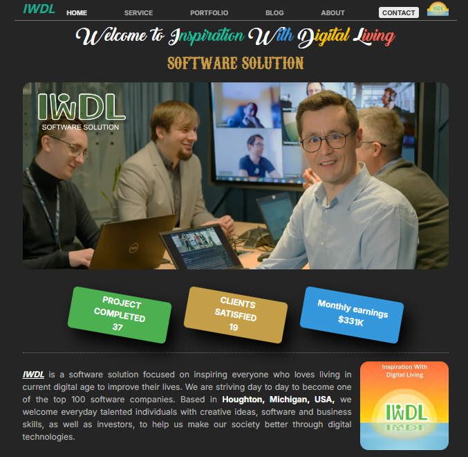

# IWDL Company Website

This repository contains the codebase for the IWDL company website. The project is built using Next.js, Tailwind CSS, and TypeScript. Its style sheets are compiled using Sass. And It interacts with Firestore to retrieve and store internal data. Lastly, it’s compatible with Gmail for sending emails through the contact page.



## Table of Contents

- [Introduction](#introduction)
- [Features](#features)
- [Getting Started](#getting-started)
- [Installation](#installation)
- [Usage](#usage)
- [Project Structure](#project-structure)
- [Contributing](#contributing)
- [License](#license)

## Introduction

The IWDL company website is designed to provide information about IWDL's services, team, and projects. It is a modern, responsive, and performant web application.

## Features

- **Next.js**: A React framework that supports server-side rendering and static site generation, providing optimized performance and SEO benefits.
- **Tailwind CSS**: A utility-first CSS framework that enables rapid UI development with a focus on flexibility and efficiency.
- **Sass**: A CSS preprocessor and compiler used to create maintainable, modular, and reusable stylesheets, enhancing the styling workflow.
- **TypeScript**: A typed superset of JavaScript that enhances code reliability by providing type safety.
- **Firestore**: A cloud-based NoSQL database used for real-time data retrieval and storage, allowing for scalable and flexible data management.
- **GMAIL**: Utilizes Gmail’s reliable SMTP server to send emails directly from the contact page, ensuring secure and efficient delivery.

## Getting Started

To get a local copy up and running, follow these steps.

### Prerequisites

Make sure you have the following installed:

- Node.js (version 14.x or later)
- npm or yarn

### Installation

1. Clone the repository:

   ```bash
   git clone https://github.com/ideal-softer/IWDL.git
   cd IWDL
   npm install
   npm run dev

2. Project structure

### A typical top-level directory layout

    .
    ├── public                  # Public assets
    ├── src                     # Source code for the project
    |  ├── app                  # Directory each router in App-router
    |  |  ├── about             # about page router
    |  |  ├── api               # Directory each APIs
    |  |  |  ├── send-email.ts  # API router for sending email
    |  |  ├── blog              # blog page router
    |  |  ├── contact           # contact page router
    |  |  ├── home              # home page router
    |  |  ├── portfolio         # portfolio page router
    |  |  ├── service           # service page router
    |  |  ├── favicon.ico       # main icon
    |  |  ├── layout.tsx        # layout router in App-router
    |  |  ├── not-found.tsx     # note-found page
    |  |  ├── page.tsx          # main router in App-router
    |  |  ├── providers.tsx     # root structure
    |  ├── assets               # every asset files, such as images, scss/css, fonts, icons
    |  ├── components           # reusable components
    |  |  ├── layouts           # layout components such as header, footer, main panel
    |  |  ├── pages             # each page components
    |  |  |  ├── about.tsx      # about page
    |  |  |  ├── blog.tsx       # blog page
    |  |  |  ├── contact.tsx    # contact page
    |  |  |  ├── home.tsx       # home page
    |  |  |  ├── portfolio.tsx  # portfolio page
    |  |  |  ├── service.tsx    # service page
    |  ├── libs                 # Every static, parameter values, and libraries defined here
    |  |  |  ├── const.tsx      # const values
    |  |  |  ├── firebase.tsx   # firebase account credential
    |  |  |  ├── methods.tsx    # Typescript functions defined here
    |  |  |  ├── types.tsx      # Every type defined here
    |  ├── store                # Reducer
    |  |  |  ├── header.ts      # Reducer actions in header component
    |  |  |  ├── mask.ts        # Reducer actions for page mask
    |  |  |  ├── index.ts       # Interface to Reducer
    ├────────────────────────────────────────────────────────────────